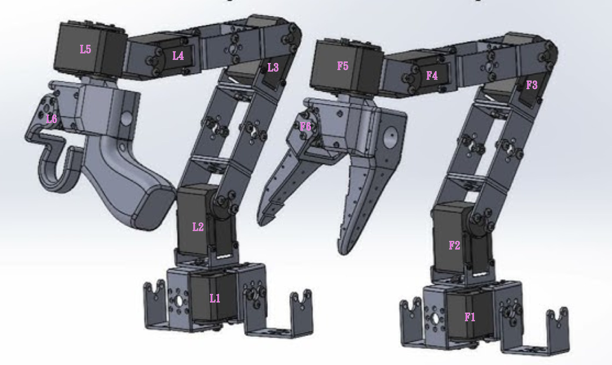

# LeRobot Servo Adjuster

使用 Rust 的 Axum 框架建立一個 Web 服務，用於對 LeRobot 的校正檔（JSON 格式）進行「伺服馬達參數微調」。此工具支援 follower 與 leader 兩種類型的配置，並透過 Askama 模板引擎提供一個簡單直觀的網頁使用者介面。

## 主要功能

- **互動式視覺介面**: 在機械臂圖片上以熱點 (Hotspot) 標示出可調整的伺服馬達，點擊即可進行編輯。
- **即時參數編輯**: 即時調整伺服馬達的 `drive_mode`, `homing_offset`, `range_min`, `range_max` 等參數。
- **直觀的旋鈕控制**: 使用可拖拉的虛擬旋鈕 (Knob) 來精確調整數值參數。
- **可移動的控制面板**: 設定面板是一個半透明的浮動視窗，可以隨意拖拉，避免遮擋視線。
- **設定檔管理**: 方便地在不同的機器人 (robots) 和遙控器 (teleoperators) 設定檔之間切換。
- **直接更新 JSON**: 所有變更都會直接儲存回對應的 JSON 設定檔中。
- **輕量高效後端**: 後端服務由 Rust 語言及 Axum 框架打造，確保了執行效率和穩定性。

## API 端點（節選）
- `GET /api/profiles?kind=robots|teleoperators` 列出 profiles
- `GET /api/profiles/{kind}/{profile}` 讀取單一 profile
- `PATCH /api/profiles/{kind}/{profile}` 局部更新
- `PUT /api/profiles/{kind}/{profile}` 全量更新
- `POST /api/profiles/{kind}` 建立 profile
- `DELETE /api/profiles/{kind}/{profile}` 刪除 profile

## UI 使用
- **首頁 (`/`)**: 瀏覽所有機器人 (robots) 與遙控器 (teleoperators) 的設定檔清單。
- **控制頁面 (`/arm/{kind}/{name}`)**: 點擊首頁的設定檔連結，進入主要的視覺化調整介面。
- **JSON 編輯頁面 (`/profiles/{kind}/{name}`)**: 提供原始 JSON 的編輯模式。

## 快速開始

1.  安裝 Rust (`rustup`)
2.  專案的相依套件已於 `Cargo.toml` 設定 (Axum, Tokio, Serde, Askama 等)
3.  執行專案： `cargo run`
4.  開啟瀏覽器並前往 `http://127.0.0.1:8000`

## 更多資訊
- 開發說明：見 `DEVELOP.md`
- 開發代辦：見 `TODO.md`